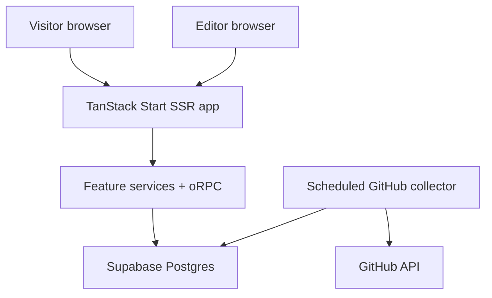

# HowToBuild.dev — Research-Backed Implementation Plan

**Revision:** 2.0  
**Research checked:** September 4, 2026  
**Purpose:** Product, editorial, design, and engineering plan for the first public release.

## Executive decisions

- Launch the useful read-only product before community features: curated project pages, category pages, search, and transparent momentum.
- Keep Postgres as the source of truth; treat GitHub as an external signal, never as the editorial database.
- Build the smallest editorial workflow in the first vertical slice. Publishing from code would contradict the product model.
- Keep the chosen TanStack/oRPC/Better Auth stack, but make it pass a production deployment spike before committing the whole application. TanStack Start is still labeled **RC** in its current official documentation.
- Use aggregate GitHub snapshots for momentum. Do not design around enumerating stargazers: GitHub introduced access restrictions for stargazer listings in July 2026.
- Make the public UI feel like a living editorial field guide, not a generic SaaS dashboard. Real project artifacts, attributed documentary photography, visible editorial judgment, and deliberate typographic character should carry the identity.
- Treat image rights, attribution, crop, alt text, and source provenance as stored content—not as notes in a designer's browser history.

## Release definition

The first public release is successful when a visitor can answer, without signing in:

1. What is gaining momentum?
2. Why is it worth attention?
3. What is it good—and bad—for?
4. What will it cost?
5. What complete stack could I use instead of assembling one from scratch?

Accounts and submissions are valuable growth loops, but they must not delay the core read-only discovery experience.

## 1. Product Vision

**HowToBuild.dev** is a curated discovery platform for developers who want to know:

> What should I use to build a modern software project today?

The product should help developers quickly discover:

- What technologies are currently gaining momentum.
- Which frameworks and tools are worth evaluating.
- Which complete technology stacks work well together.
- What each technology is actually useful for.
- Whether a project is open source.
- Whether it can be used for free.
- Whether its hosted free tier is generous enough for a new project.
- How much community momentum a project currently has.
- Which new AI-native development tools are emerging.

HowToBuild.dev should not become another exhaustive technology directory.

The value comes from **curation, recency, momentum, and opinionated recommendations**.

---

## 2. Product Positioning

The primary homepage question should be:

> **What's hot in software development right now?**

The secondary question should be:

> **What should I use to build my next project?**

This gives HowToBuild.dev two complementary discovery modes:

1. **Trending discovery**
   - What's gaining traction now?
   - What new projects should I know about?
2. **Intentional discovery**
   - I need a frontend framework.
   - I need a TypeScript backend.
   - I need observability.
   - I need an AI coding tool.
   - I want an entire production-ready stack.

The website should feel closer to a curated technology radar than a traditional documentation website.

---

## 3. Core Technology Decisions

| Area | Decision | Implementation note |
| --- | --- | --- |
| Full-stack framework | **TanStack Start + React + TypeScript** | It provides full-document SSR, streaming, server routes/functions, and TanStack Router. It is still marked **RC**, so pin exact versions and require the Phase 0 deployment spike before broad implementation. |
| Routing | **TanStack Router** | Use file-based public, account, and admin route trees. Generate canonical metadata on the server. |
| Server state | **TanStack Query** | Use it for interactive/filterable data and authenticated mutations; do not make already SSR-rendered public content wait for a client fetch. |
| Application API | **oRPC** | Mount through the TanStack Start Fetch adapter. Keep procedures thin; business rules live in feature services that can be tested without HTTP. |
| Database | **Supabase Postgres** | Postgres is the source of truth. Use Supavisor for serverless/edge-style deployments and a normal application pool for a persistent Node runtime. |
| SQL access and migrations | **Drizzle ORM + SQL migrations** | This was missing from the original plan. Drizzle is also a documented Better Auth adapter. Keep ranking/search queries in reviewed SQL when that is clearer than an ORM expression. |
| Authentication | **Better Auth** | Better Auth owns users, accounts, sessions, verification records, Google, GitHub, and email OTP. Do not also enable Supabase Auth. |
| Authentication UI | **Better Auth UI as an accelerator** | It is a separate MIT-licensed project built for Better Auth, not a substitute for accessibility and security testing. Prefer copied shadcn components so the UI can be brought into the site's visual language. |
| Search | **Postgres full-text search for V1** | Use a weighted `tsvector`, `websearch_to_tsquery`, and a GIN index. Add aliases/synonyms for terms such as “auth,” “IaC,” and “AI coding.” Defer an external search service until measured relevance or scale demands it. |
| Background work | **Hosting-native scheduled job + database lease** | Run GitHub synchronization from a scheduled worker, not from user requests. Store run state and use a database lease/advisory lock so retries cannot create overlapping collectors. |
| Transactional email | **Provider selected in Phase 0** | Required for OTP. The provider, sender domain, deliverability checks, and abuse controls must be decided before auth work starts. |
| Images | **Object storage/CDN selected in Phase 0** | Store optimized derivatives and source metadata. Never depend on third-party hotlinks in production. |

Supabase is the database provider, not the application API or authentication authority. The server connects to Postgres; public and authenticated reads/writes go through server-side services and oRPC procedures.

Package versions must be pinned with a lockfile. Automated dependency updates should open reviewed pull requests rather than silently changing the production stack.

---

## 4. Important Architecture Change

The original concept was to store all project information directly inside the frontend and redeploy the website whenever content changed.

That should no longer be the architecture.

Because HowToBuild.dev will now have:

- User accounts
- Project submissions
- Submission moderation
- GitHub statistics
- Historical GitHub snapshots
- Trending calculations
- Full-stack recommendations
- Admin/editor workflows

the database should become the source of truth.

The application should still remain extremely SEO-focused and render public content server-side.

Editorial changes should therefore **not require an application deployment**.

An editor should be able to publish a new tool or update an existing tool and have it appear on the website without touching application code.

### Runtime boundaries



- Public route loaders read only **published projections**. Drafts and moderation records must never leak into public responses, sitemaps, search results, or metadata.
- Admin mutations require both an authenticated session and a server-side role check. Hiding the admin UI is not authorization.
- The collector is the only component that writes raw GitHub observations. A deterministic ranking job derives momentum from stored observations.
- Route loaders may call feature services directly on the server. Browser-initiated mutations and interactive fetches use oRPC. Do not make the server call its own HTTP API during SSR.

### Minimum data model

| Table/group | Purpose | Key rules |
| --- | --- | --- |
| `projects` | Stable identity and editorial content | UUID primary key; unique canonical slug; `draft`, `published`, `archived`; created/published/reviewed timestamps; editor IDs. |
| `project_links` | Website, docs, repository, pricing, changelog | Normalized URL; link type; last successful check; redirect target; failure count. |
| `repositories` | A project can have zero, one, or several repositories | Unique GitHub repository node ID; owner/name; default repository flag; sync state and ETag. |
| `github_snapshots` | Append-only aggregate observations | Repository ID + observed-at unique; stars, forks, open issues, pushed-at, latest release; never overwrite history. |
| `project_momentum` | Derived daily scores and evidence | Window, absolute delta, relative growth, confidence, activity factor, anomaly flags, algorithm version. |
| `categories`, `facets`, `project_facets` | Controlled taxonomy | Slugs are stable; display labels can change; facets cover language, ecosystem, type, and tags. |
| `pricing_assertions` | Time-sensitive editorial claims | Classification, scope, source URL, checked-at, checked-by, and optional review-due date. |
| `recommendations` | Editorial state separate from trending | Badge, rationale, editor, start/end dates. |
| `stacks`, `stack_items`, `stack_alternatives` | Curated stack content | Published state; responsibility per item; ordered rationale, tradeoff, and alternative. |
| `submissions`, `edit_suggestions` | Community input | Immutable submitted payload plus moderation state; never write directly to `projects`. |
| `assets` | Logos, screenshots, and photography | Local/CDN path, source page, creator, license, captured-at, alt text, focal point, checksum. |
| `editorial_revisions`, `audit_events` | Accountability and rollback | Actor, action, before/after or revision reference, timestamp, and reason. Append-only audit trail. |
| Better Auth tables | Identity and sessions | Generated from the pinned Better Auth version; do not hand-edit without a migration. |

### Content provenance and freshness

Every important statement should declare what kind of fact it is:

- **Automated observation:** GitHub stars, forks, release date, repository activity.
- **Maintainer claim:** copied or summarized from official docs/pricing pages with a source URL.
- **Editorial judgment:** “best for,” “not ideal for,” recommended badge, and stack rationale.
- **Community claim:** remains in moderation until an editor verifies it.

Store `source_url`, `checked_at`, and `checked_by` for volatile claims such as pricing, license, self-hosting, and hosted free-tier limits. “Unknown” is a valid value and is better than inferred certainty.

### Publishing model

Publishing must be atomic: validate required fields, create a revision, update public state, invalidate the relevant page/search/sitemap caches, and record an audit event in one transaction or coordinated workflow. A failed cache refresh must not lose the publication record; it should enqueue a retry.

---

## 5. Main Categories

V1 will contain six primary categories:

### Frontend

Frontend frameworks, meta-frameworks, component systems, state/data tools, styling systems, and browser-focused development tools.

### Backend

Backend frameworks, API frameworks, runtimes, ORMs, databases, authentication systems, queues, and server infrastructure.

### Mobile

Native and cross-platform mobile frameworks, libraries, runtimes, tooling, and mobile infrastructure.

### DevOps

Deployment, infrastructure, containers, CI/CD, infrastructure-as-code, platform engineering, and developer infrastructure.

### Observability

Logging, tracing, metrics, errors, application monitoring, OpenTelemetry tooling, and developer observability platforms.

### AI Tools

AI-native development tools including:

- Coding agents
- AI IDEs
- Agent orchestration
- Multi-agent tools
- CLI agents
- AI SDKs
- Model infrastructure
- AI application frameworks
- AI developer productivity tools

---

## 6. Taxonomy

Not every category should be forced into a programming-language hierarchy.

For Frontend, Backend, and Mobile, programming language will often be the primary organization mechanism.

Examples:

- Frontend → TypeScript
- Backend → TypeScript
- Backend → Go
- Backend → Rust
- Mobile → Dart
- Mobile → Kotlin
- Mobile → Swift

For DevOps, Observability, and AI Tools, the primary organization mechanism can instead be an ecosystem or use case.

Examples:

- DevOps → Infrastructure as Code
- DevOps → CI/CD
- DevOps → Containers
- Observability → OpenTelemetry
- Observability → Error Tracking
- Observability → Logs
- AI Tools → Coding Agents
- AI Tools → AI IDEs
- AI Tools → Agent Orchestration

Programming languages should still be available as filters wherever relevant.

---

## 7. The Core Content Object: Project

Everything listed on HowToBuild.dev should be considered a **Project**, rather than calling everything a framework.

A Project can represent:

- Framework
- Library
- Platform
- SaaS
- CLI
- Runtime
- Database
- SDK
- IDE
- Coding agent
- AI tool
- Infrastructure tool
- Observability tool
- Authentication system
- Deployment platform
- Developer service

Each Project should contain enough editorial information to answer five questions immediately:

### What is it?

A very short description understandable without visiting the project's website.

### Why is it interesting?

One concise explanation of why HowToBuild.dev believes developers should pay attention to it.

### What should I use it for?

Specific use cases.

### What does it cost?

Clear pricing categorization.

### Is the project gaining momentum?

GitHub and editorial signals.

---

## 8. Project Information

Every Project should support:

- Name
- Logo
- Short description
- Longer editorial explanation
- Category
- Subcategory
- Programming languages
- Technology type
- Tags
- Official website
- Official documentation
- GitHub repository
- Open-source status
- License
- Self-hosting status
- Pricing classification
- Total GitHub stars
- Stars gained over approximately 7 days
- Stars gained over approximately 30 days
- GitHub growth percentage
- Repository activity
- Recommended use cases
- Major advantages
- Important tradeoffs
- Related projects
- Alternative projects
- Compatible stacks
- Editorial status

Projects should be capable of belonging to several contexts without being duplicated.

For example, a technology could participate in both a Backend category and multiple full-stack recommendations.

---

## 9. Pricing Classification

Pricing information is an important differentiator for HowToBuild.dev.

Each project should clearly show one or more badges such as:

### Open Source

The source code is openly licensed.

### Free to Self-Host

Developers can run the project themselves without paying the vendor.

### Free

The core product can meaningfully be used without payment.

### Generous Free Tier

A hosted product can reasonably support a new project for free until meaningful usage or scale is reached.

This is appropriate for products similar to the Clerk example.

### Limited Free Tier

A free hosted tier exists but has constraints that developers are reasonably likely to encounter early.

### Paid

Meaningful production usage requires payment.

### Enterprise

Pricing or important functionality primarily targets organizations and larger teams.

The product should distinguish **open source** from **free hosted service**.

A project can therefore simultaneously be:

> Open Source · Free to Self-Host · Paid Cloud

Pricing labels should be editorially maintained because commercial pricing can change.

---

## 10. Trending System

Trending is one of the most important parts of the product.

It should not simply rank projects by total GitHub stars.

A repository with 100,000 stars is not necessarily hotter today than a new repository that gained 5,000 stars this month.

HowToBuild.dev should track:

- Total stars
- Approximate stars gained in the last 7 days
- Approximate stars gained in the last 30 days
- 7-day growth percentage
- 30-day growth percentage
- Repository activity
- Recent releases
- Project age where relevant

The system should store historical GitHub metric snapshots.

This allows HowToBuild.dev to calculate its own momentum history instead of depending on GitHub to provide historical star analytics.

### V1 ranking model

Do not tune a mysterious “AI score.” Start with a deterministic, versioned formula whose inputs can be inspected:

```text
absolute_7d  = max(stars_now - stars_7d_ago, 0)
absolute_30d = max(stars_now - stars_30d_ago, 0)
relative_7d  = absolute_7d / max(stars_7d_ago, 100)

momentum =
  0.45 * percentile(log1p(absolute_7d), within_category) +
  0.25 * percentile(log1p(absolute_30d), within_category) +
  0.20 * percentile(relative_7d, within_category) +
  0.10 * activity_factor
```

This is a starting hypothesis, not a permanent truth. The exact weights stay internal, but the algorithm version and public methodology must be maintained.

Apply these rules before ranking:

- Require at least two observations spanning five days for a weekly rank and 21 days for a monthly rank.
- Label incomplete windows as **Early signal**; do not extrapolate missing days.
- Cap the influence of relative growth for very small repositories through the denominator floor.
- Normalize within category, then blend a small global component only if cross-category ranking is needed.
- Compute and store an anomaly flag; anomalous projects remain reviewable but cannot automatically occupy the primary homepage slot.
- Store the exact snapshot IDs and algorithm version that produced each published ranking.

Public evidence should show the observation window and confidence, for example: `+1,240 stars · Sep 28–Oct 5 · complete window`.

---

## 11. Trending vs Editorial Recommendations

Two concepts should remain separate.

### Trending

Calculated primarily from measurable momentum.

Examples:

- Rapid 7-day growth
- Rapid 30-day growth
- Strong relative growth
- Recent development activity

### Recommended

An editorial decision made by HowToBuild.dev.

A project can therefore be:

- Trending
- Recommended
- Both
- Neither

Additional editorial badges can include:

- **Recommended**
- **Worth Watching**
- **New**
- **Fast Growing**
- **Established**
- **Open Source**

The internal numeric trending score does not need to be displayed publicly.

Instead, users should see the evidence:

> ★ 24.8k
> +1.4k last 7 days
> +4.9k last 30 days

This is much more useful than showing an unexplained score such as `Hot Score: 87`.

---

## 12. GitHub Statistics and Collection

GitHub metadata should be refreshed automatically on a recurring basis.

The website should record periodic snapshots of:

- Total stars
- Forks
- Open issues where useful
- Repository activity
- Latest release
- Relevant repository metadata

The snapshots will allow HowToBuild.dev to calculate changes over time.

At minimum:

- 7-day star change
- 30-day star change
- 7-day percentage growth
- 30-day percentage growth

The application must not depend on retrieving the identities of individual stargazers. GitHub's current API documentation says stargazer-listing access became restricted to repository admins and collaborators in July 2026; the aggregate count remains the appropriate input for this product.

Snapshots of aggregate repository statistics should become HowToBuild.dev's historical dataset. Use an authenticated GitHub App or token kept only on the server. Persist ETags and make conditional requests; GitHub documents that authorized `304 Not Modified` responses do not consume the primary REST rate limit. Collect serially through a queue, honor `Retry-After` and rate-limit headers, and use exponential backoff.

### Collector behavior

- Sync active repositories on a fixed cadence; daily is sufficient for V1 trend windows. A six-hour cadence is acceptable for a small launch catalog if the rate-limit budget and operational cost are measured.
- Fetch the repository summary and latest published release. Treat “no releases” as valid, not as a sync failure.
- Save one normalized observation per repository per collection window, even if the upstream response is unchanged.
- Store `collected_at`, upstream `pushed_at`, release timestamps, response ETag, request outcome, and collector version.
- Follow GitHub redirects and update renamed repository coordinates while preserving the stable repository identity.
- Backfill no star history from current stargazer identities. A new project earns 7/30-day deltas only after enough aggregate snapshots exist.
- Surface stale or failed syncs in `/admin/metrics`; never silently display an old number as current.

For newly added projects that do not yet have seven or thirty days of history, the UI should simply show the metrics that are available instead of inventing historical values.

---

## 13. Homepage

Route:

`/`

The homepage should prioritize **Trending Now**.

### Homepage structure

#### Hero

Simple statement explaining the product.

Example positioning:

> **Discover what developers are building with now.**

Supporting statement:

> Curated frameworks, tools, AI products, and production-ready stacks for modern software development.

Primary discovery actions:

- Explore Trending
- Explore Stacks

A global search should also be highly visible.

---

### Trending Now

The first significant content section.

Show the highest-momentum projects currently being tracked.

Each card should communicate:

- Project name
- Logo
- One-line purpose
- Category
- Technology type
- Open-source indicator
- Pricing indicator
- Total stars
- 7-day star growth
- 30-day star growth
- Trending indicator

Users should immediately understand *why* a project is appearing in Trending.

---

### Trending by Category

Sections or tabs for:

- Frontend
- Backend
- Mobile
- DevOps
- Observability
- AI Tools

---

### Recommended Stacks

Feature a small number of complete stacks.

Examples might include:

- Modern TypeScript SaaS
- AI SaaS
- Open-Source SaaS
- TypeScript Backend
- Production AI Application
- Modern Observability Stack

---

### Worth Watching

A curated section for relatively young projects that may not yet have enough GitHub history to dominate Trending.

This allows editorial discovery to complement the quantitative rankings.

---

### Categories

Provide direct access to all six top-level categories.

---

### Footer

The global footer is the **only place on the public website where the site's overall update date should be displayed**.

Example:

> Last updated September 4, 2026

Individual cards and category pages should not display generic "last updated" timestamps.

The footer date should represent the most recent meaningful editorial publication/update rather than every automated background metric refresh.

---

## 14. Trending Page

Route:

`/trending`

Dedicated page for discovering projects based on momentum.

Users should be able to filter by:

- Category
- Programming language
- Project type
- Open source
- Pricing model
- Time period

Primary time views:

- Trending this week
- Trending this month

Potential sorting options:

- Fastest growing
- Most stars gained
- Total stars
- Recently added

Trending should default to momentum rather than lifetime popularity.

---

## 15. Category Pages

Routes:

- `/frontend`
- `/backend`
- `/mobile`
- `/devops`
- `/observability`
- `/ai-tools`

Each category page should contain:

### Category introduction

A short SEO-friendly explanation of what the category covers.

### Trending in this category

Projects currently gaining momentum.

### Recommended

Curated choices that HowToBuild.dev recommends developers evaluate.

### Languages or ecosystems

Examples:

Frontend:

- TypeScript
- JavaScript
- Rust

Backend:

- TypeScript
- Go
- Rust
- Python
- Java
- C#
- PHP

AI Tools:

- Coding Agents
- AI IDEs
- Agent Orchestration
- AI SDKs
- Model Infrastructure

### All projects

Searchable and filterable project listing.

---

## 16. Language / Ecosystem Pages

Example routes:

- `/frontend/typescript`
- `/backend/typescript`
- `/backend/go`
- `/backend/rust`
- `/mobile/dart`
- `/devops/infrastructure-as-code`
- `/observability/opentelemetry`
- `/ai-tools/coding-agents`

These pages should be SEO landing pages rather than simple filters.

Each should provide:

- Short explanation of the ecosystem
- Trending projects
- Recommended projects
- Established projects
- Worth-watching projects
- Relevant full stacks
- Comparisons where relevant

---

## 17. Project Detail Pages

Route:

`/projects/:project`

Every listed project should have its own indexable page.

The page should answer:

> Should I consider using this technology?

### Project page content

#### Overview

- Project name
- Logo
- Short description
- Category
- Type
- Languages
- Website
- Documentation
- GitHub

#### Why it's interesting

A short HowToBuild.dev editorial explanation.

#### Best for

Concrete scenarios where the project is a strong option.

#### Not ideal for

Important tradeoffs or scenarios where another tool would likely be more appropriate.

This is essential to keep the recommendations credible.

#### Open source & pricing

Clearly communicate:

- Open-source status
- License
- Self-hostability
- Hosted service availability
- Free-tier classification

#### GitHub momentum

Show:

- Total stars
- 7-day stars gained
- 30-day stars gained
- Growth percentages where useful

#### Works well with

Other technologies frequently used alongside the project.

#### Included in stacks

Show complete HowToBuild.dev stacks containing this project.

#### Alternatives

Provide relevant alternatives rather than forcing users back to search.

---

## 18. Full Stacks

Route:

`/stacks`

Full-stack recommendations should become a major product feature.

Rather than merely telling developers what individual tools are interesting, HowToBuild.dev should answer:

> If I were starting this project today, what would I use?

Examples:

- Modern TypeScript SaaS
- AI SaaS
- Open-Source SaaS
- Developer Tool SaaS
- TypeScript API
- AI Agent Application
- Mobile SaaS
- Self-Hosted SaaS
- High-Scale Backend
- Modern Observability

---

## 19. Stack Detail Pages

Route:

`/stacks/:stack`

Each stack should have a clear purpose.

Example:

> **Modern TypeScript SaaS**

The page should explain:

### What this stack is for

What type of product the combination is intended to build.

### Who should use it

Ideal developer/team profile.

### Technologies included

Organized by responsibility rather than arbitrarily.

Examples of responsibilities:

- Application framework
- API layer
- Data fetching
- Database
- Database access
- Authentication
- Styling
- Email
- Payments
- File storage
- Background jobs
- Deployment
- Analytics
- Error monitoring
- Observability
- AI infrastructure

Not every stack needs every responsibility.

### Why each technology was chosen

Every component should have a short rationale.

### Open-source profile

Clearly communicate which pieces are open source.

### Cost profile

Show whether each piece is:

- Free
- Free to self-host
- Generous free tier
- Limited free tier
- Paid

### Estimated early-stage friendliness

Stacks can receive an editorial classification such as:

- Excellent for bootstrapping
- Good for startups
- Optimized for scale
- Optimized for self-hosting
- Optimized for developer experience

### Tradeoffs

Every recommended stack should explicitly explain its disadvantages.

### Alternatives

For important parts of a stack, provide alternatives.

Example:

> Authentication: Better Auth
> Alternative: Clerk if you prefer managed authentication infrastructure.

---

## 20. First Official HowToBuild.dev Stack

HowToBuild.dev itself should become one of the site's first stack examples.

### HowToBuild.dev Stack

- TanStack Start
- React
- TypeScript
- TanStack Router
- TanStack Query
- oRPC
- Supabase Postgres
- Better Auth
- Better Auth UI

This creates a useful piece of meta-content:

> See how HowToBuild.dev itself was built.

It also demonstrates the type of recommendations the website provides.

---

## 21. Search

Route:

`/search`

Search should work across:

- Projects
- Categories
- Languages
- Ecosystems
- Stacks

Users should be able to search terms such as:

- React
- auth
- TypeScript backend
- AI coding
- observability
- Postgres
- free hosting

Search results should identify the result type clearly.

### V1 search implementation

Use Postgres full-text search before adding another service:

- Build a weighted search document: project/stack name and aliases at weight A; one-line purpose and tags at B; editorial body at C.
- Use a GIN index; PostgreSQL documents GIN as the preferred full-text index type.
- Parse raw user input with `websearch_to_tsquery`, which accepts search-like syntax and does not raise syntax errors for ordinary user input.
- Blend text relevance with small, bounded editorial and momentum boosts. A popular result must not defeat an exact name match.
- Maintain an alias table for abbreviations, former names, and common misspellings.
- Return grouped result types with accessible headings and a useful empty state.
- Record privacy-preserving aggregate zero-result queries so editors can improve synonyms and content. Do not store raw IP addresses with queries.
- Set a performance budget: p95 server search below 300 ms for the launch catalog.

Use server-rendered links for permanent category/ecosystem pages. Interactive filter combinations should not generate an unbounded indexable URL space.

---

## 22. Authentication

Authentication is required for community contribution features.

Supported authentication:

- Continue with GitHub
- Continue with Google
- Continue with email

Email authentication should use OTP rather than passwords.

The authentication interface should use **Better Auth UI** as the reusable base rather than designing and maintaining an authentication interface from scratch.

The authentication experience should remain simple.

No password account flow should be required for V1.

---

## 23. Authentication Routes

Routes:

- `/sign-in`
- `/verify`
- `/account`

The sign-in page should present:

1. Continue with GitHub
2. Continue with Google
3. Continue with email

Email should trigger an OTP verification flow.

The account page should primarily exist to support contributions rather than becoming a social profile.

---

## 24. Community Project Submissions

Route:

`/submit`

Authenticated users should be able to submit projects.

This is an important growth mechanism for HowToBuild.dev.

The submission process should start with the simplest possible input:

> **GitHub repository URL**

When possible, HowToBuild.dev should retrieve the obvious repository metadata automatically.

The submitter should then provide or confirm:

- Project name
- Website
- Documentation
- Short explanation
- Category
- Project type
- Relevant languages/ecosystems
- Why the project is interesting
- Pricing information
- Open-source information

Submission should not automatically publish the project.

All submissions enter moderation.

---

## 25. Submission Guidelines

Route:

`/submit/guidelines`

Explain what qualifies for inclusion.

The guidelines should reinforce that HowToBuild.dev is curated rather than exhaustive.

Projects should generally demonstrate one or more of:

- Significant developer interest
- Rapid growth
- Technical innovation
- Strong developer experience
- Interesting open-source development
- New approach to an existing problem
- Important AI-native capability
- Meaningful ecosystem adoption

Projects should not qualify simply because someone submitted them.

---

## 26. User Submission Dashboard

Route:

`/account/submissions`

Users should see projects they have submitted.

Statuses:

- Submitted
- Under review
- Changes requested
- Approved
- Published
- Rejected

For rejected submissions, a short moderation reason should be available when appropriate.

Users should eventually be able to suggest updates to existing projects as well.

---

## 27. Suggest an Edit

Project page action:

> Suggest an edit

Authenticated users should be able to suggest changes to:

- Description
- Links
- Category
- Pricing
- Open-source information
- Documentation
- Other factual information

Suggested edits should enter moderation rather than modifying production content immediately.

This becomes increasingly valuable as the catalog grows.

---

## 28. Administration

Private routes:

- `/admin`
- `/admin/projects`
- `/admin/submissions`
- `/admin/stacks`
- `/admin/categories`
- `/admin/metrics`

The admin experience should prioritize editorial workflow rather than database management.

---

## 29. Admin Dashboard

The admin home should show:

- Pending project submissions
- Pending edit suggestions
- Recently published projects
- Projects with broken links
- Projects with missing GitHub information
- Projects whose pricing information may need review
- Projects currently gaining unusual momentum
- Projects being considered for Trending
- Recent metric sync status

This should become the control center for maintaining HowToBuild.dev.

---

## 30. Project Moderation

Editors should be able to:

- Review a submission
- Edit submitted information
- Approve
- Reject
- Request changes
- Publish
- Unpublish
- Mark as recommended
- Mark as worth watching
- Assign categories
- Assign languages
- Assign tags
- Configure pricing labels
- Add editorial notes
- Add a project to stacks

Publishing should not require redeploying the application.

---

## 31. Stack Administration

Editors should be able to create a stack by:

- Naming the stack
- Defining its purpose
- Defining its target user
- Selecting technologies
- Assigning each technology a responsibility
- Explaining each selection
- Adding alternatives
- Describing tradeoffs
- Defining cost characteristics
- Publishing or unpublishing

Stacks are editorial content and should never be generated automatically solely from popularity metrics.

---

## 32. Methodology Page

Route:

`/methodology`

Transparency will increase trust.

Explain:

- What "Trending" means
- How GitHub momentum is measured
- Why total stars are not enough
- Difference between Trending and Recommended
- How projects are selected
- How pricing labels are determined
- What "Open Source" means on the site
- How submissions are reviewed
- Why some popular projects may not appear

Do not expose unnecessary details that make the ranking system easy to game.

---

## 33. About Page

Route:

`/about`

Explain the mission:

> Software development changes too quickly for static lists. HowToBuild.dev tracks the projects, frameworks, tools, and stacks worth understanding now.

Explain that the product combines:

- Public ecosystem signals
- GitHub momentum
- Editorial curation
- Community submissions

---

## 34. SEO Strategy

SEO should be treated as a core product requirement.

Public content must be server rendered.

The initial HTTP response must include the primary content, canonical URL, title, description, and crawlable `<a href>` links. Google still recommends server-side rendering or pre-rendering because it is faster for users and crawlers, and not every bot executes JavaScript.

Important pages should be directly indexable.

Indexable pages include:

- Homepage
- Trending
- Categories
- Languages
- Ecosystems
- Projects
- Stacks
- Methodology
- About

Authentication, account, submission management, and admin routes should not be indexed.

Every Project page should have unique:

- Title
- Description
- Canonical URL
- Social sharing metadata

Every public page must also return a meaningful status code: `404` for an unknown or permanently removed slug, `301` for a canonical slug change, and `200` only for a real page. Redirect history should live in the database so renamed projects preserve inbound links.

### Index control

- Index: published project, category, ecosystem, stack, methodology, about, and the two stable trending views.
- `noindex, follow`: arbitrary search results and most multi-filter combinations.
- `noindex, nofollow`: sign-in, verification, account, submission management, admin, and preview routes.
- Canonicalize a filtered view to itself only when it has deliberately authored landing-page content; otherwise canonicalize to the stable category/ecosystem page or noindex it.
- Include only canonical `200` URLs in the XML sitemap. Use `lastmod` only for meaningful content changes, not every automated metric refresh.

### Structured data

- Use `BreadcrumbList` where visible breadcrumbs exist and `WebSite`/organization data where accurate.
- Consider `SoftwareApplication` only for project pages that genuinely meet Google's required and recommended properties. Never invent ratings, prices, operating systems, or offers to qualify for a rich result.
- Validate samples with Google's Rich Results Test and inspect deployed pages in Search Console before scaling the markup.
- Open Graph images should be generated from factual project data using a controlled template, not a stock photo or AI illustration.

Category and ecosystem pages must contain meaningful editorial content rather than merely filtered cards.

Stacks should also be indexable because they target valuable search intent such as:

- Best TypeScript stack
- Best SaaS stack
- Modern React stack
- Open-source SaaS stack
- AI app stack
- Best backend stack

Each indexable page needs a content owner and minimum unique editorial content. Programmatically generating hundreds of thin permutations is explicitly outside V1.

---

## 35. URL Strategy

Public routes:

- `/`
- `/trending`
- `/frontend`
- `/frontend/:ecosystem`
- `/backend`
- `/backend/:ecosystem`
- `/mobile`
- `/mobile/:ecosystem`
- `/devops`
- `/devops/:ecosystem`
- `/observability`
- `/observability/:ecosystem`
- `/ai-tools`
- `/ai-tools/:ecosystem`
- `/projects/:project`
- `/stacks`
- `/stacks/:stack`
- `/search`
- `/methodology`
- `/about`
- `/submit`
- `/submit/guidelines`

Authenticated routes:

- `/sign-in`
- `/verify`
- `/account`
- `/account/submissions`

Private editorial routes:

- `/admin`
- `/admin/projects`
- `/admin/submissions`
- `/admin/stacks`
- `/admin/categories`
- `/admin/metrics`

Legal routes:

- `/privacy`
- `/terms`

---

## 36. Filtering

Project listings should support filtering by:

- Programming language
- Ecosystem
- Project type
- Open source
- Self-hostable
- Free
- Generous free tier
- Trending
- Recommended
- Worth watching

Filters should complement the permanent SEO routes rather than replace them.

---

## 37. Comparison Capability

A lightweight project comparison feature should be planned for after the initial release.

Route:

`/compare`

Potential comparison URL:

`/compare/:project-vs-project`

Useful comparisons include:

- Framework vs framework
- Auth provider vs auth provider
- ORM vs ORM
- Deployment platform vs deployment platform
- AI coding agent vs AI coding agent

Comparison dimensions can include:

- Purpose
- Open source
- Pricing
- Self-hosting
- GitHub stars
- Momentum
- Developer experience
- Best for
- Tradeoffs

This should be considered V1.1 rather than blocking V1.

---

## 38. Content Update Cadence

The editorial catalog should be actively reviewed approximately every **2–3 days**.

This does not mean every project needs to change every two days.

Each editorial cycle should focus on:

- Newly emerging projects
- Major releases
- Projects gaining unusual momentum
- Pricing changes
- Open-source changes
- Projects losing relevance
- New stacks
- Community submissions

GitHub metrics can update more frequently in the background.

The public website should not display update timestamps throughout the interface.

Only the footer shows the global:

> Last updated [date]

---

## 39. Metric Collection Cadence

GitHub metrics should be collected independently from the editorial update schedule.

A daily regular snapshot provides enough history to calculate meaningful trends. A six-hour snapshot may be tested for the small launch catalog, but it should be adopted only if the additional freshness is visible to users and the collector remains comfortably within its rate-limit and cost budgets.

The system should retain historical snapshots instead of overwriting the previous measurement.

This historical dataset becomes an increasingly valuable HowToBuild.dev asset because it allows the product to understand momentum over time.

Freshness states must be explicit in data and operations:

- **Healthy:** latest observation is within 30 hours.
- **Delayed:** 30–72 hours; continue showing the last observation with an internal warning.
- **Stale:** more than 72 hours; remove the project from automatic trending placement until a healthy sync returns.
- **Disabled:** repository archived, deleted, private, or manually excluded.

---

## 40. Anti-Gaming Requirements

Trending systems can attract manipulation.

HowToBuild.dev should therefore avoid ranking projects solely by one metric.

Safeguards should include:

- Relative and absolute growth
- Minimum data requirements
- Detection of abnormal spikes
- Editorial ability to exclude suspicious projects
- Category normalization
- Manual review for prominent homepage placement
- Minimum repository age and observation-window confidence
- Detection of rename, archive, transfer, and sudden visibility changes
- Per-ranking explanation records and algorithm versioning

A project gaining thousands of suspicious stars should not automatically take over the homepage.

---

## 41. Design Principles

### Design position: an editorial field guide made by people

The visual experience should communicate modern, developer-focused, fast, opinionated, credible, and technical—but it should not look like a generated SaaS template.

The reference is an independent technical magazine crossed with a well-kept field notebook: real artifacts, strong information hierarchy, small signs of editorial authorship, and enough irregularity to feel composed rather than emitted.

Use GitHub Explore for evidence density and recognizable repository metadata, and roadmap.sh for navigable developer taxonomy. Do not copy either site's layout, visual language, or brand.

### Anti-slop rules

Avoid these default patterns unless a specific user need justifies them:

- Purple/cyan gradient heroes, glow effects, glass panels, decorative blobs, and fake 3D “AI” objects.
- A centered headline above three equal rounded feature cards.
- Putting every paragraph in a floating card. Use page sections, rules, lists, and whitespace.
- Large generic outline icons above headings; label actions with words and use icons only as reinforcement.
- Identical card grids for every content type. Trending, stacks, essays, and categories should have different editorial rhythms.
- Excessive pill badges, 16–24 px corner radii, giant shadows, and hover motion that makes the interface feel weightless.
- Synthetic people, fake screenshots, decorative code that cannot be read, or imagery without a source record.
- Generic copy such as “supercharge,” “seamless,” “unlock,” and “revolutionize.” State what the product does and who made the judgment.

### Visual system

#### Typography

- Use **Fraunces** for selected display headlines to add editorial character, **IBM Plex Sans** for interface/body text, and **IBM Plex Mono** only for metrics, code, and labels.
- Self-host the exact font files and subsets used. Provide sensible system fallbacks and keep body text at 16 px minimum.
- Headlines may wrap naturally; do not force every title into a two-line marketing lockup. Keep paragraphs to roughly 60–75 characters per line.
- Use sentence case. Reserve all-caps for very short metadata labels with increased tracking.

#### Color and material

- Default light canvas: warm paper, dark ink, muted rules, and one restrained vermilion/rust accent. Reserve green for verified positive growth and red for warnings/errors.
- Category colors are navigational accents, not full-card backgrounds. Every status must also have a text label or symbol.
- Prefer 1 px rules, small blocks of flat color, and occasional editorial highlight marks over shadows.
- If dark mode is added, design and test it as a full palette; do not make a neon-on-black theme the brand.

#### Shape, spacing, and composition

- Use a 12-column desktop grid but allow deliberate asymmetry: featured editorial items can span 7/5, while routine results use calm full-width rows or compact cards.
- Use a restrained radius scale: 0, 4, and 8 px. Logos may keep their native silhouette.
- Keep the spacing system consistent, then introduce humanity through image crops, headline scale, and editorial composition—not random misalignment.
- Data tables are acceptable on desktop when comparison is the task; cards are not automatically more human. Provide a stacked semantic presentation on mobile.

#### Motion

- Motion should explain state: filter transitions, disclosure, save/submit feedback. Use 120–180 ms for ordinary transitions.
- Avoid scroll-jacking, perpetual marquees, parallax decoration, cursor effects, and springy hover lifts.
- Honor `prefers-reduced-motion`; no required information may depend on animation.

### Three layers of imagery

1. **Project identity:** official logo or mark obtained from the maintainer's official site/repository/media kit. Preserve aspect ratio and record trademark guidance.
2. **Product evidence:** screenshots captured by the editorial team from the real product/docs/repository. Add a date and caption when the interface may age.
3. **Human context:** a small, rotating set of documentary photographs for homepage/editorial breaks, About, Methodology, and submission stories. These are not card backgrounds.

Do not place unrelated stock photography on every category page. One strong image per major editorial surface is enough. The core directory remains information-first.

### Candidate photography shortlist

These are source-page links, not production hotlinks. Download the selected originals, record the license at download time, make local AVIF/WebP/JPEG derivatives, and credit the photographer even when the license does not require it.

| Placement | Candidate and source | Intended treatment |
| --- | --- | --- |
| Homepage editorial break | [Christopher Gower — MacBook with code on a busy desk](https://unsplash.com/photos/a-macbook-with-lines-of-code-on-its-screen-on-a-busy-desk-m_HRfLhgABo) | Wide 3:2 crop; keep the imperfect desk context; never use as text wallpaper. |
| Methodology | [Amélie Mourichon — hand sketching a product prototype](https://unsplash.com/photos/person-writing-on-printing-paper-wusOJ-2uY6w) | Landscape crop with paper texture visible; caption around “how judgments are made.” |
| Stacks introduction | [Jo Szczepanska — hands arranging a paper collage](https://unsplash.com/photos/person-holding-paper-cutout-decors-RTnDfYr1G6U) | Treat the physical assembly as a metaphor for stack composition; muted crop, not a literal diagram. |
| About / editorial process | [Hands arranging notes during a work session](https://unsplash.com/photos/person-holding-white-paper-near-white-ceramic-mug-on-brown-wooden-table-riX6HX3gCZk) | Confirm and record the photographer name from the downloaded asset metadata; use only if the final crop reads as a real work session rather than generic productivity stock. |
| Submission guidance | [Lukas Blazek — person coding on a laptop](https://www.pexels.com/photo/person-encoding-in-laptop-574071/) | Close editorial crop; pair with a real submission example and photographer credit. |
| DevOps feature | [Field Engineer — configuring cables on a server](https://www.pexels.com/photo/electronics-engineer-fixing-cables-on-server-442150/) | Vertical or square detail crop; use to add physical reality to infrastructure coverage. |
| Experimental tools / maker story | [cottonbro studio — programming amid cables and hardware](https://www.pexels.com/photo/a-person-programming-a-black-laptop-8720589/) | Use for a “worth watching” editorial story, not as the generic AI Tools header. |

Unsplash and Pexels both permit broad free use under their respective licenses, but the team must still check the exact asset page, model/property concerns, and current terms at download time. Keep a source-page screenshot or license record in the asset manifest. Never imply that a depicted person endorses a listed project.

### Image implementation requirements

- Store originals privately and serve optimized derivatives from the site's own image domain/CDN.
- Generate at least 480, 768, 1200, and 1600 px widths when the source supports them; emit `srcset` and explicit width/height to prevent layout shift.
- Use AVIF first, WebP second, and JPEG/PNG only as needed. Logos that are truly vector should remain sanitized SVG.
- Set a focal point per asset so responsive crops do not remove hands, faces, screens, or the meaningful artifact.
- Write contextual alt text; use empty alt text for purely decorative crops. Captions carry credit and source, not alt text.
- Lazy-load below-the-fold editorial images. Do not lazy-load the likely LCP image.
- Keep the homepage image payload under 700 KB on a typical mobile viewport and make the hero usable with images disabled.

### Proof of human authorship

The interface should visibly show judgment:

- Name the editor/reviewer on project and stack pages where appropriate.
- Show “Why it is here,” “Best for,” “Not ideal for,” and the factual sources behind volatile claims.
- Use specific, varied sentence structure. Preserve small differences in project stories instead of forcing every entry through an identical paragraph template.
- Publish a methodology changelog and corrections path.
- Schedule real user sessions: at least five developers across different experience levels should complete the core discovery tasks before launch. Record where they hesitate; do not ask only whether the UI “looks good.”

---

## 42. Project Card Requirements

A standard Project card should communicate almost everything necessary to decide whether to open the project.

The ideal hierarchy is:

**Project name**

Short purpose.

Then compact metadata:

- Category/type
- Open-source/pricing badges
- GitHub stars
- 7-day growth
- 30-day growth

Avoid filling cards with long descriptions.

The card itself should be mostly flat, with one border or divider and a deliberate typographic hierarchy. Do not make every metadata value a pill. Use a maximum of two prominent badges; move the rest into a compact labeled row or accessible details region.

Card variants:

- **Trending row:** rank, project identity, one-line purpose, absolute window delta, total stars, category.
- **Editorial feature:** larger screenshot or documentary crop, editor rationale, and one explicit tradeoff.
- **Stack item:** responsibility first, then project and rationale; do not reuse the trending layout.
- **Search result:** result type, matched phrase/context, and canonical destination.

---

## 43. Mobile Experience

The site must remain highly usable on mobile.

Important requirements:

- Trending should remain understandable without tables.
- Project metrics should stack cleanly.
- Filters should use a mobile-friendly drawer or equivalent interaction.
- Cards should remain scan-friendly.
- Search should be easily accessible.
- Stack contents should remain understandable as a sequential list.

---

## 44. Accessibility

Accessibility should be part of V1 and tested against **WCAG 2.2 AA**.

Requirements include:

- Full keyboard navigation
- Semantic navigation
- Accessible dialogs
- Accessible authentication
- Clear focus states
- Sufficient contrast
- Screen-reader-friendly labels
- No reliance on color alone for status
- Reflow without loss of information at 320 CSS px
- Pointer targets at least 24 × 24 CSS px or with WCAG-compliant spacing; prefer 44 × 44 px for primary mobile controls
- Visible focus that is not hidden behind sticky navigation or drawers
- Reduced-motion behavior and usable zoom to 200%
- Accessible names and error recovery for search, filters, OTP, submission, and moderation forms
- Automated checks in CI plus manual keyboard, screen-reader, zoom, and contrast passes

Using a mature accessible component foundation for authentication and interactive controls should reduce duplicated accessibility work, but copied components and third-party UI still require product-specific testing.

---

## 45. V1 Scope

V1 should include:

### Discovery

- Homepage
- Trending
- Six categories
- Language/ecosystem pages
- Project pages
- Search
- Filtering

### Project intelligence

- Total GitHub stars
- Historical metric snapshots
- 7-day momentum
- 30-day momentum
- Open-source status
- Pricing classifications
- Editorial descriptions
- Recommendations

### Stacks

- Stack directory
- Individual stack pages
- Open-source information
- Cost information
- Reasons for each technology choice
- Alternatives and tradeoffs

### Community

- Google sign-in
- GitHub sign-in
- Email OTP
- Submit project
- Submission status
- Suggest edits

### Editorial administration

- Project management
- Submission moderation
- Stack management
- Category management
- Metrics health

### SEO

- SSR public pages
- Metadata
- Canonical URLs
- Sitemap
- Structured internal linking
- Indexable project/category/stack pages

---

## 46. V1.1

After V1 proves the discovery model, add:

- Project comparison
- Stack comparison
- More sophisticated trend analysis
- Contributor reputation
- Saved projects
- Saved stacks
- Personal technology shortlist
- Weekly trending digest
- Project update suggestions
- Richer GitHub activity measurements

---

## 47. Things We Should Explicitly Avoid in V1

Do not build:

- Comments
- Forums
- Project reviews
- Star ratings
- Social feeds
- Following users
- Public user profiles
- AI chat assistant
- Personalized recommendation engine
- Complex reputation system
- Job board
- Courses
- Tutorials

They dilute the core proposition.

V1 needs to establish one behavior:

> Developers visit HowToBuild.dev because they trust it to tell them which technologies are worth paying attention to right now.

---

## 48. Recommended Initial Content Target

The first release should favor quality over catalog size.

A realistic private-alpha target is **36–48 projects**: 6–8 excellent entries in each category. This is enough to test taxonomy, cards, search, pricing, and momentum without burying the team in stale content.

The public V1 target can then expand to approximately:

- 12–18 Frontend projects
- 12–18 Backend projects
- 8–12 Mobile projects
- 8–12 DevOps projects
- 8–12 Observability projects
- 15–20 AI Tools

Alongside:

- 4 deeply researched stacks at launch
- 4 additional stack drafts ready for the next editorial cycles

This creates a launch catalog of roughly **63–92 projects**, not a quota that forces weak entries. It is better to launch with 60 excellent, maintained entries than 100 rushed ones or 5,000 uncurated ones.

Each launch project must have: verified canonical links, license/open-source state, pricing source and check date, “best for,” at least one tradeoff, category/facets, image provenance, and an editorial owner. Missing GitHub history is allowed and must be labeled honestly.

---

## 49. Initial Stack Collection

Good starting stack concepts:

### Modern TypeScript SaaS

An opinionated default for building a modern SaaS product.

### Open-Source SaaS

Prioritize tools developers can self-host.

### AI SaaS

A modern stack for building AI-powered applications.

### AI Agent Application

Infrastructure specifically suited to agentic applications.

### Modern TypeScript API

Backend-first TypeScript stack.

### Bootstrapper SaaS

Optimize for generous free tiers and minimal initial infrastructure cost.

### Scale-Ready SaaS

Optimize for systems likely to outgrow entry-level hosted tiers.

### Modern Observability

An opinionated observability setup for a new production application.

### HowToBuild.dev

The real stack powering HowToBuild.dev itself.

---

## 50. Product Success Criteria

V1 succeeds if users can answer these questions quickly:

### "What developer tools are blowing up right now?"

Answered by Trending.

### "What's a good modern TypeScript backend?"

Answered by category + ecosystem discovery.

### "What should I use to build a SaaS today?"

Answered by Stacks.

### "Is this project actually gaining traction?"

Answered by 7-day and 30-day GitHub momentum.

### "Will this cost me money immediately?"

Answered by pricing classifications.

### "Can I self-host this?"

Answered by open-source and self-hosting information.

### "Why are you recommending this?"

Answered by editorial reasoning.

### "I found a great new project. How do I get it listed?"

Answered by community submissions.

### Measurable launch criteria

- In moderated usability sessions, at least 4 of 5 participants can find a suitable project for a stated scenario and explain one tradeoff within 90 seconds.
- At least 90% of published project records pass the complete-content checklist; 100% of volatile pricing and license claims have a source and check date.
- At least 95% of active repositories are in the **Healthy** metric state, and no stale repository enters an automatic trending slot.
- Search returns a relevant top-five result for a maintained benchmark set of names, aliases, categories, and intent queries.
- Public templates meet Core Web Vitals targets at the 75th percentile: LCP ≤ 2.5 s, INP ≤ 200 ms, and CLS ≤ 0.1, measured separately on mobile and desktop when field data is available.
- No critical or serious automated accessibility findings, plus successful manual keyboard and screen-reader runs through search, filters, sign-in, OTP, and submission.
- Restore a production-like database backup into an isolated environment before launch; a backup that has never been restored is not a tested recovery plan.
- Every publish, unpublish, moderation, recommendation, and pricing change produces an attributable audit event.

---

## 51. Implementation Order

Work in vertical slices. Each phase must leave the product deployable and include tests, instrumentation, and an exit gate.

### Phase 0 — Prove the risky seams

Build one disposable-but-production-shaped slice:

- Pin TanStack Start, React, Better Auth, Better Auth UI, oRPC, Drizzle, and database driver versions.
- Deploy SSR to the intended production runtime; verify streaming, cookies, environment variables, server-only code, a real Postgres query, and a 404 status.
- Mount one oRPC query and mutation through the TanStack Start Fetch adapter.
- Run Better Auth with one social provider and email OTP in a non-production environment; validate secure cookies, redirect URLs, logout, resend limits, and error states.
- Exercise the chosen Supabase connection mode under a small concurrency test.
- Run one scheduled GitHub collection with authentication, ETag reuse, retry behavior, and an append-only snapshot.
- Upload, transform, and serve one logo and one editorial photograph from the chosen image host.
- Select the transactional email provider and establish the sender domain.

**Exit gate:** the deployed spike passes SSR, auth, database, scheduled-job, and asset checks. If TanStack Start RC behavior blocks production needs, decide on a framework fallback before product work expands.

---

### Phase 1 — Editorial vertical slice

Build:

- Global navigation
- The minimum project/taxonomy/source/asset schema
- Invite-only editor authentication and server-side roles
- Draft, preview, publish, unpublish, revision, and audit flows
- One real category page, one project page, and a compact homepage
- Image manifest and derivative pipeline
- HTML metadata, canonical URL, sitemap generation, robots rules, and real status codes
- 12–18 representative seed projects across all six categories
- Design tokens and the four card/list variants

**Exit gate:** an editor can publish a sourced project without code or deployment, and a crawler receives complete HTML for the public page while drafts remain private.

---

### Phase 2 — Discovery and GitHub intelligence

Add:

- Remaining category and ecosystem landing pages
- Postgres full-text search, aliases, zero-result instrumentation, and filters
- GitHub metadata collection
- Historical snapshots
- Versioned 7-day/30-day momentum calculations, confidence, and anomaly flags
- Trending page
- Trending homepage sections
- Metric health and manual exclusion controls
- 36–48 fully reviewed projects for private alpha
- Accessibility, performance, and relevance benchmark suites

**Exit gate:** the benchmark query set passes, incomplete windows are labeled, stale data cannot rank automatically, and five developers can complete the core discovery task in moderated testing.

---

### Phase 3 — Stacks and public beta

Add:

- Stack directory
- Stack detail pages
- Technology responsibilities
- Cost information
- Open-source information
- Alternatives
- Tradeoffs
- Relevant project-to-stack connections
- Four launch-quality stacks
- 63–92 launch-quality projects, as editorial capacity allows
- Methodology, About, corrections, privacy, and terms pages
- Search Console, web analytics, error monitoring, and Core Web Vitals collection

**Exit gate:** each stack contains a target user, responsibility map, rationale, cost profile, alternatives, tradeoffs, and sources. Public beta can launch here without community accounts.

---

### Phase 4 — Community contribution loop

Add:

- Complete Google, GitHub, and email OTP sign-in UI
- Account and session management
- Submit project
- Submission guidelines
- Submission status
- Suggest edit
- Moderation workflow
- Admin submission queue
- Per-IP and per-account rate limits, spam controls, duplicate detection, and abuse reporting

**Exit gate:** no community action changes published content directly; auth and submission abuse tests pass; editors can request changes, approve, reject, and explain status.

---

### Phase 5 — Operational hardening and general availability

Complete:

- Admin dashboard
- Metrics health
- Broken-link monitoring
- Pricing/license review reminders
- Backup-restore drill and written recovery procedure
- Security headers, dependency scanning, secrets review, and incident runbook
- Load, cache, and failure-mode tests
- Accessibility audit and remediation
- Final image/license/trademark audit
- Editorial rota and 2–3 day review workflow

**Exit gate:** the measurable launch criteria pass, operational owners are named, and maintaining the site every 2–3 days is demonstrably sustainable.

---

## 52. Verification Strategy

| Layer | Required coverage |
| --- | --- |
| Unit | Ranking windows, confidence, anomaly rules, pricing labels, URL normalization, permissions, and search weighting. |
| Database | Migration up/down policy, uniqueness, publication transaction, append-only snapshot behavior, and query plans for search/trending. |
| Contract | oRPC input/output/error shapes and authorization for every mutation. |
| Integration | GitHub `200`/`304`/redirect/rate-limit/failure cases; email send failures; image processing; cache invalidation. |
| End to end | Browse → filter → project → stack; editor draft → preview → publish; sign-in → OTP → submit → moderation. |
| Accessibility | Automated CI checks plus keyboard, screen reader, zoom/reflow, reduced motion, and mobile target size. |
| Performance | Server timings, query p95, image budgets, bundle budgets, and Core Web Vitals on representative templates. |
| Editorial | Link/source verification, screenshot age, pricing/license review date, copy edit, alt text, and tradeoff completeness. |

## 53. Security and Abuse Baseline

- Validate GitHub submissions as canonical `https://github.com/{owner}/{repo}` coordinates, then call GitHub's API. Do not fetch arbitrary user-provided URLs from the server; this reduces SSRF risk.
- Rate-limit OTP send/verify, sign-in, submission, edit suggestion, search, and preview endpoints by appropriate combinations of IP, account, and target.
- Use generic auth responses where needed to limit account enumeration. Store OTPs hashed or encrypted, enforce expiry and attempt limits, and never log the code.
- Use secure, HTTP-only, same-site cookies; rotate/revoke sessions when required and protect state-changing browser requests against CSRF.
- Sanitize any rich text at write time and render time. Prefer a constrained Markdown subset; user HTML is not required.
- Enforce editor/admin authorization inside each server procedure and service method. Record privileged actions in the append-only audit log.
- Keep GitHub, OAuth, email, database, and image-host credentials server-only and out of previews, logs, analytics, and client bundles.
- Define retention and deletion behavior for accounts, submissions, audit events, and operational logs before accepting public contributions.

## 54. Risk Register

| Risk | Likelihood / impact | Mitigation and trigger |
| --- | --- | --- |
| TanStack Start RC regression or deployment mismatch | Medium / High | Phase 0 production-runtime spike, exact pins, smoke suite, and documented fallback decision before Phase 1. Re-evaluate on every framework upgrade. |
| GitHub API limits or policy changes | Medium / High | Aggregate count snapshots, GitHub App auth, ETags, queue, backoff, stored last-good values, health states. Trigger review on API changelog or repeated delayed syncs. |
| Ranking is gamed or over-rewards small spikes | High / High | Minimum windows, denominator floor, category normalization, anomaly flags, manual homepage review, algorithm versions. Trigger review on anomalous deltas or credible reports. |
| Catalog becomes stale | High / High | Content owner, sources/check dates, review-due queues, broken-link checks, smaller launch catalog. Trigger when freshness SLO or editorial cadence misses twice. |
| Faceted pages create duplicate/thin SEO inventory | Medium / Medium | Curated index allowlist, `noindex` for arbitrary combinations, canonicals, sitemap tests. Trigger on Search Console duplicate/crawled-not-indexed growth. |
| Third-party logos/photos create rights or endorsement concerns | Medium / High | Asset manifest, source/license/trademark review, local derivatives, credits, takedown path. Trigger on source/license change or rights request. |
| Community submission spam and auth-email abuse | High / Medium | Progressive rate limits, duplicate checks, moderation-only publication, optional CAPTCHA after abuse signals. Trigger on delivery/bounce spikes or queue load. |
| Editorial/admin scope delays the useful product | Medium / High | Minimum editor slice in Phase 1; public beta before community accounts; strict non-goals. Trigger when a phase grows beyond its exit gate. |

## 55. Research Sources and Decision Notes

These sources were checked on September 4, 2026. Re-check them before implementation because framework and platform behavior changes.

### Architecture and platform

- [TanStack Start overview](https://tanstack.com/start/latest/docs/framework/react/overview) — SSR, streaming, server functions/routes, and full-stack build capabilities.
- [TanStack Start current product page](https://tanstack.com/start/latest) — current **RC** lifecycle label.
- [TanStack Start routing](https://tanstack.com/start/latest/docs/framework/react/guide/routing) — file-based routing behavior.
- [oRPC TanStack Start adapter](https://orpc.dev/docs/adapters/tanstack-start) — Fetch adapter and server-route mounting.
- [oRPC TanStack Query integration](https://orpc.dev/docs/integrations/tanstack-query) — typed query/mutation option integration.
- [Supabase database connections](https://supabase.com/docs/guides/database/connecting-to-postgres) — direct versus pooled connections and Supavisor guidance.
- [Supabase backups](https://supabase.com/docs/guides/platform/backups) — managed backups and restore behavior.

### Authentication

- [Better Auth TanStack Start integration](https://better-auth.com/docs/integrations/tanstack) — supported integration pattern.
- [Better Auth email OTP](https://better-auth.com/docs/plugins/email-otp) — send/verify flow, expiry, attempt limits, and storage options.
- [Better Auth database model](https://better-auth.com/docs/concepts/database) and [Drizzle adapter](https://better-auth.com/docs/adapters/drizzle) — schema and adapter decisions.
- [Better Auth UI repository](https://github.com/better-auth-ui/better-auth-ui) — separate MIT-licensed UI project and component options.
- [OWASP Authentication Cheat Sheet](https://cheatsheetseries.owasp.org/cheatsheets/Authentication_Cheat_Sheet.html) and [Forgot Password Cheat Sheet](https://cheatsheetseries.owasp.org/cheatsheets/Forgot_Password_Cheat_Sheet.html) — enumeration, automated-request, and recovery controls relevant to OTP.

### GitHub data and search

- [GitHub REST rate limits](https://docs.github.com/en/rest/using-the-rest-api/rate-limits-for-the-rest-api) — authenticated limits, response headers, and retry behavior.
- [GitHub REST best practices](https://docs.github.com/en/rest/using-the-rest-api/best-practices-for-using-the-rest-api) — conditional requests, serial queues, redirects, and error handling.
- [GitHub starring endpoints](https://docs.github.com/en/rest/activity/starring) — aggregate count semantics and the July 2026 stargazer-listing restriction.
- [PostgreSQL text-search controls](https://www.postgresql.org/docs/current/textsearch-controls.html) and [preferred text-search indexes](https://www.postgresql.org/docs/current/textsearch-indexes.html) — weighted documents, `websearch_to_tsquery`, ranking, and GIN.

### SEO, performance, and accessibility

- [Google JavaScript SEO basics](https://developers.google.com/search/docs/crawling-indexing/javascript/javascript-seo-basics) — SSR/pre-rendering, crawlable links, status codes, canonicals, structured data, and lazy-loaded images.
- [Google SoftwareApplication structured data](https://developers.google.com/search/docs/appearance/structured-data/software-app) — eligibility, required properties, and validation workflow.
- [Google sitemap guidance](https://developers.google.com/search/docs/crawling-indexing/sitemaps/build-sitemap) — sitemap construction and submission.
- [Web Vitals](https://web.dev/articles/vitals) — current LCP, INP, and CLS thresholds and 75th-percentile measurement.
- [WCAG 2.2 Quick Reference](https://www.w3.org/WAI/WCAG22/quickref/) — AA requirements including focus visibility, dragging alternatives, and minimum target size.

### Design, image sourcing, and brand care

- [GitHub Explore](https://github.com/explore) and [roadmap.sh](https://roadmap.sh/) — current product references for repository evidence and developer taxonomy, used for analysis rather than imitation.
- [IDEO.org Design Kit](https://www.designkit.org/) — human-centered discovery, prototyping, and testing methods.
- [Anima, “Graphic Design in 2026”](https://animaapp.com/blog/ai-design-en/graphic-design/) — industry commentary on generic AI output, brand memory, hierarchy, editorial composition, and human texture; treated as a directional reference, not a standard.
- [Bowen Craggs, “Visual design in the AI age”](https://www.bowencraggs.com/our-thinking/latest-articles/visual-design-in-the-ai-age/) — practitioner commentary on retaining differentiation and human judgment as generated visual production becomes easier.
- [Unsplash License](https://unsplash.com/license) and [Pexels License](https://www.pexels.com/license/) — terms for the candidate photography sources.
- [Wikimedia Commons reuse guidance](https://commons.wikimedia.org/wiki/Commons:Reusing_content_outside_Wikimedia) — attribution process if Commons assets are later selected.
- [GitHub trademark policy](https://docs.github.com/en/site-policy/content-removal-policies/github-trademark-policy) — reminder that source availability does not erase trademark/endorsement concerns.

---

## 56. Final Product Principle

HowToBuild.dev should never attempt to answer:

> What software projects exist?

It should answer:

> **What software projects should I know about right now, why do they matter, and which ones should I actually use to build something?**

That distinction should guide every product decision.
